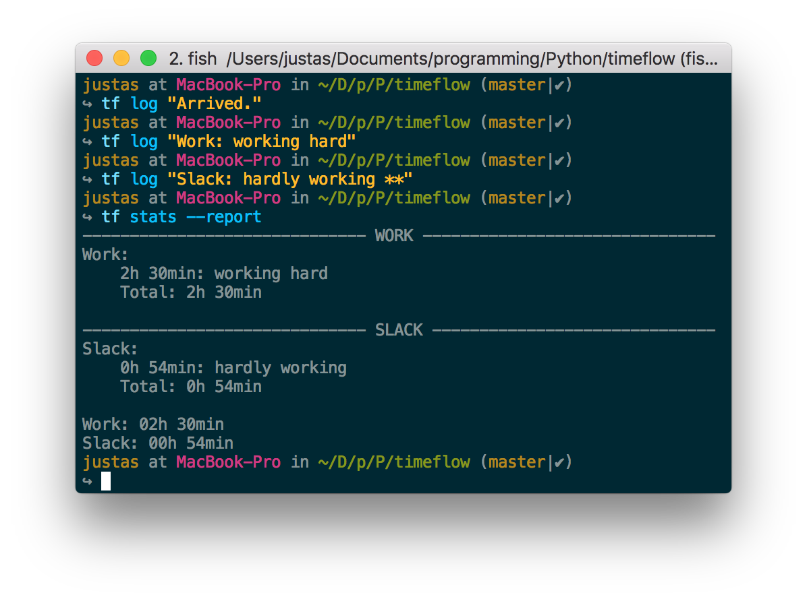

timeflow
========
simple CLI time logger, inspired by `gtimelog <https://github.com/gtimelog/gtimelog>`_

Description
-----------
``timeflow`` is a simple CLI time logger, used for logging your activities and
featuring simple statistics and reporting capabilities

``timeflow`` can be called using either ``tf`` or ``timeflow`` commands

Install
-------

``pip3 install timeflow``

Written in ``python3``. Best user experience with ``python3``.

Tutorial
-----------------
::

    to start working (message content is not important)
    >>> tf log "Arrived."

    to save a timestamp and your log message,
    when finished doing a task write
    >>> tf log "Timeflow: create README.rst"

    here 'Timeflow' is a 'project' you were working on and 'create README.rst'
    is a log of what you were exactly doing this time. Both project and log
    must be separated by a colon and space (``: ``).

    some tasks are not (payable) work, mark them with two asterisks (**)
    >>> tf log "Slack: chatting in the office ** "

    you can have 'projects' without any explanations
    >>> tf log "Lunch ** "
    >>> tf log "Daily Scrum"

    if you made a mistake, or missed to log of your activities
    you can edit like this
    >>> tf edit

    this way timeflow will try to run your editor set in $EDITOR
    or you can try
    >>> tf edit -e vim

    to open log file in vim

    to check how much you've worked today
    >>> tf stats

    or to make a report
    >>> tf stats --report

    you can pass date ranges for stats command, e.g.
    >>> tf stats --from 2015-01-01 --to 2015-01-31
    >>> tf stats --from 2015-01-01 --to 2015-01-31 --report

Commands & options
------------------
``log``
    ``log LOG_TEXT`` - create new log entry to timeflow's log file.

``edit``
    opens timeflow's log file, by default trying to open an editor used in ``$EDITOR`` environment variable.

    ``-e EDITOR`` - passes editor to be used in opening log file.

``stats``
    shows today's work and slack time.

    ``-y, --yesterday`` - shows yesterday's work and slack time.

    ``-d DATE, --day DATE`` - shows arbitrary day's work and slack time.

    ``--week WEEK_NUMBER`` - shows arbitrary week's work and slack time.

    ``--last-week`` - shows last week's work and slack time.

    ``--month MONTH_NUMBER`` - shows arbitrary month's work and slack time.

    ``--last-month`` - shows last month's work and slack time.

    ``-f DATE, --from DATE`` - shows work and slack time, from DATE until today, if ``--to`` option is not used.

    ``-t DATE, --to DATE`` - shows work and slack time, up to DATE. Must be used with ``--from`` option.

    ``--report`` - shows report for today, or some other time range if specified using available options.
